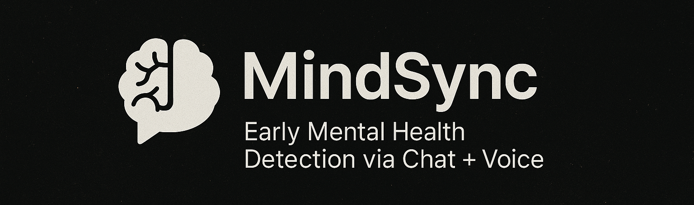

# 🧠 MindSync – Early Mental Health Detection via Chat + Voice



[](LICENSE)


---

## 🌐 Overview

**MindSync** is an AI-powered mental wellness web app that detects early signs of stress, anxiety, or burnout through both chat and voice input. By leveraging natural language processing and emotional analysis, it offers personalized support suggestions and therapist recommendations.

---

## 🎯 Why MindSync?

- 🎙️ **Multimodal Emotion Detection**: Integrates chat and voice input for more accurate mental state evaluation.
- 🧠 **AI + ML Integration**: Uses NLP and emotion recognition models to detect underlying emotional cues.
- 📊 **Feedback Dashboard**: Visualizes emotional trends over time (upcoming feature).
- 🤝 **Real-World Value**: Ideal for students, employees, and HR departments for wellness monitoring.
- 🛡️ **Privacy-Oriented**: Supports anonymous use and secure data handling.

---

## 🔧 Tech Stack

| Layer         | Technologies                   |
|---------------|--------------------------------|
| **Frontend**  | React, TailwindCSS             |
| **Backend**   | Node.js, Express               |
| **ML/NLP**    | Python (Emotion Detection)     |
| **Database**  | MongoDB / Firebase             |
| **Voice Input** (optional) | WebRTC             |

---

## ✨ Key Features

- 🔹 AI-powered real-time chat with sentiment tracking  
- 🔹 Voice input support with tone/emotion analysis  
- 🔹 Suggestions for mental health practices or therapy  
- 🔹 Secure and anonymous sessions  
- 🔹 Future scope: Admin analytics dashboard for HR/teachers

---

---

## 🚀 Getting Started

### 1. Clone the Repo

```bash

```sh
# Step 1: Clone the repository
git clone https://github.com/dhairyaaprajapati/MindSync.git

# Step 2: Navigate to the project folder
cd MindSync

# Step 3: Install dependencies
npm install

# Step 4: Run the development server
npm run dev
